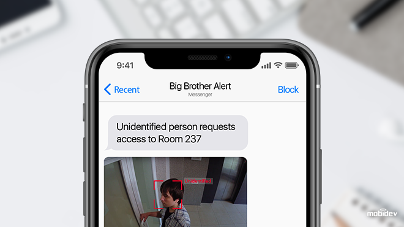

# Intel-Project-Showcase: Multi-Model Biometric Registration
## Intel Edge Project Showcase Challenge

## To Execute:

`python ./face_recognition_demo.py -m_fd OV2019-models/face-detection-retail-0004.xml -m_lm OV2019-models/landmarks-regression-retail-0009.xml -m_reid OV2019-models/face-reidentification-retail-0095.xml -d_fd MYRIAD -d_lm MYRIAD -d_reid MYRIAD --verbose -fg "Face_Gallery/"`

You may modify the -d params if you want to change the device or add --run-detector if you want to retrain.

## Project Showcase Criteria

This method fetch better accuracy than face recognition using HAARCASCADE, LBPH, HOG and SVM.

## Architecture Diagram

Plese note, while cam is under capture, press 'n' to publish data records for the next day. You can do it infinite times to insert records for future dates. 

## Unknown Person Alert to Security (FFMpeg + Twilio MMS)

